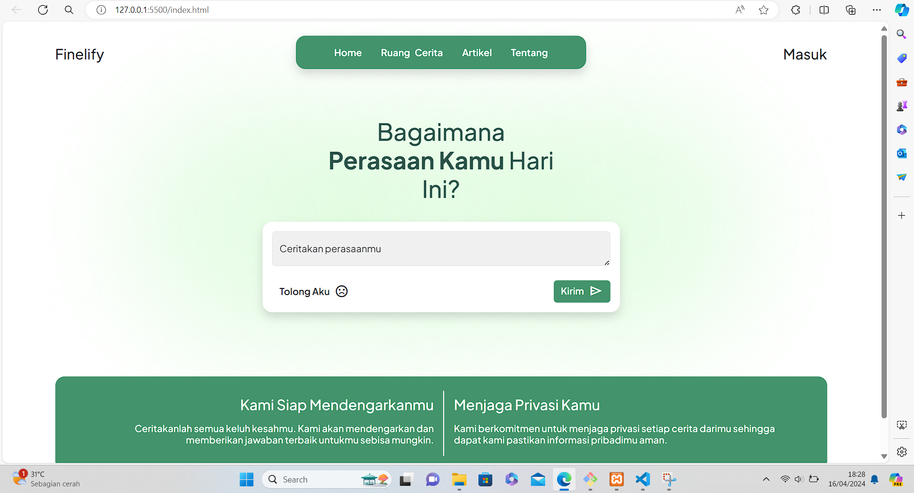

# FINELIFY

"Finelify" adalah sebuah proyek capstone bertema kesehatan mental yang bertujuan untuk memberikan solusi inovatif dalam mendukung kesejahteraan mental individu. Website Finelify menyediakan platform interaktif yang menggabungkan teknologi AI dengan pendekatan terapeutik yang holistik untuk membantu pengguna dalam mengelola stres, kecemasan, depresi, dan masalah kesehatan mental lainnya. Dengan fitur-fitur seperti peduli AI, sesi konsultasi online, artikel, forum diskusi, edukasi mental health, dan berbagi cerita dengan komunitas, Finelify berfungsi sebagai teman virtual yang dapat diandalkan dan aman untuk mengeksplorasi dan meningkatkan kesehatan mental. Melalui proyek ini, Finelify bertujuan untuk merangsang kesadaran akan pentingnya kesehatan mental dan menyediakan akses yang mudah dan terjangkau untuk mendukung individu dalam perjalanan menuju kesejahteraan holistik.

## Screenshots

## Link

 - Design : [https://www.figma.com/](https://www.figma.com/file/LCnsj0QNUt8yPSvmyFZj2F/Wireframe-%26-Prototype?type=design&node-id=2%3A2&mode=design&t=KrCnOrajRH65Pwd2-1)
 - Source Code : [https://github.com/hexafour](https://github.com/hexafour-micro-project/finelify)

## Target
- Target user : Remaja - Usia Produktif (10-35 Tahun)

- Terget Market: Masyarakat Usia Produktif, dan Orang Tua yang memiliki anak berusia remaja.
## Pembagian Tugas

#### Hustler/PM
    Muhammad Hauzan Mufid
#### Hacker/Programmer

    1. Lidya Loga Basana Munthe
    2. Zhafirah Prameswari 
    3. Kevin Sanjaya Lois

#### Hipster/Designers

    1. Ahmad Rifqi Zufar Althaf
    2. Farah Syahfitri H
